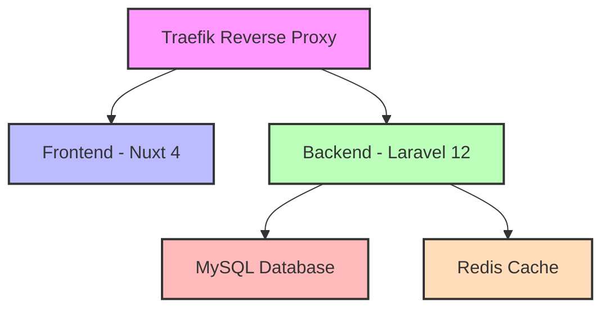

# AGENTS.md
This file provides guidance to Verdent when working with code in this repository.

## Table of Contents
1. Commonly Used Commands
2. High-Level Architecture & Structure
3. Key Rules & Constraints
4. Development Hints

## Commands

### Infrastructure
- `cd infra && docker-compose up -d` - Start all services
- `cd infra && docker-compose down` - Stop all services
- `cd infra && docker-compose logs -f [service]` - View logs for specific service
- `cd infra && docker-compose ps` - List running containers

### Backend (Laravel)
- `cd backend && composer install` - Install dependencies
- `cd backend && composer pint` - Run code style fixer
- `cd backend && composer phpstan` - Run static analysis
- `cd backend && php artisan test` - Run tests
- `cd backend && php artisan migrate` - Run database migrations
- `cd backend && php artisan serve` - Start development server (inside container runs automatically)

### Frontend (Nuxt)
- `cd frontend && npm install` - Install dependencies
- `cd frontend && npm run dev` - Start development server
- `cd frontend && npm run build` - Build for production
- `cd frontend && npm run lint` - Run ESLint
- `cd frontend && npm run lint:fix` - Fix linting issues

## Architecture

### Major Subsystems & Responsibilities



- **Traefik**: Reverse proxy and load balancer
  - Routes `localhost` → Frontend (port 3000)
  - Routes `api.localhost` → Backend (port 8000)
  - Dashboard available at `localhost:8080`

- **Frontend (Nuxt 4)**: Vue.js framework for modern web applications
  - Located in `/frontend`
  - TypeScript support enabled
  - ESLint configured for code quality
  - Communicates with backend via API calls

- **Backend (Laravel 12)**: PHP framework for API and business logic
  - Located in `/backend`
  - PHP 8.3+ required
  - Quality tools: Pint (code style), PHPStan (static analysis)
  - Database: MySQL 8.0
  - Cache: Redis 7

- **Infrastructure**: Docker Compose orchestration
  - Located in `/infra`
  - All services defined in `docker-compose.yml`
  - Environment variables in `.env` (copy from `.env.example`)

### Key Data Flows

1. **HTTP Request Flow**:
   - Browser → Traefik → Frontend (for UI) or Backend (for API)
   - Backend → MySQL (for data persistence)
   - Backend → Redis (for caching/sessions)

2. **Development Workflow**:
   - Code changes → Hot reload (both frontend and backend)
   - Git commit → GitLab CI pipeline → Lint → Analyze → Test → Build

### External Dependencies

- **Docker & Docker Compose**: Container orchestration
- **Traefik v3.0**: Reverse proxy
- **MySQL 8.0**: Relational database
- **Redis 7**: In-memory data store
- **PHP 8.3**: Backend runtime
- **Node.js 20**: Frontend runtime

### Development Entry Points

- **Frontend**: `frontend/app.vue` - Main application component
- **Backend**: Laravel follows MVC pattern
  - Routes: `backend/routes/`
  - Controllers: `backend/app/Http/Controllers/`
  - Models: `backend/app/Models/`

## Key Rules & Constraints

### Project Structure [inferred]
- **Three-tier architecture**: Infrastructure, Backend, Frontend separation
- **Monorepo structure**: All services in single repository
- **Docker-first approach**: All services run in containers

### Backend (Laravel)
- PHP version: 8.3+
- Laravel version: 12.x
- Code style must pass Pint validation
- Static analysis must pass PHPStan level 5
- All code must follow PSR-12 standards [inferred from Pint config]
- Use short array syntax [from pint.json:4]
- Single quotes for strings [from pint.json:77]
- No unused imports allowed [from pint.json:67]

### Frontend (Nuxt)
- Node version: 20 (Alpine)
- Nuxt version: 4.x (using 3.14.0 as latest stable)
- TypeScript enabled
- ESLint must pass for all code
- API base URL configurable via environment variable

### GitLab CI/CD
- Pipeline stages: install → lint → analyze → test → build
- All quality checks must pass (Pint, PHPStan)
- Tests must pass before merge
- Production builds only on master/main/production branches

### Docker & Traefik
- All services in `app-network` bridge network
- Traefik routes based on Host headers
- Persistent volumes for database data
- Auto-restart enabled for all services

## Development Hints

### Adding a New API Endpoint (Backend)

1. Create route in `backend/routes/api.php`:
   ```php
   Route::get('/example', [ExampleController::class, 'index']);
   ```

2. Create controller:
   ```bash
   php artisan make:controller ExampleController
   ```

3. Implement logic in `backend/app/Http/Controllers/ExampleController.php`

4. Run quality checks:
   ```bash
   composer pint
   composer phpstan
   php artisan test
   ```

### Adding a New Page (Frontend)

1. Create page in `frontend/pages/` directory (auto-routing)
   - Example: `frontend/pages/about.vue` → accessible at `/about`

2. Or create component in `frontend/components/`

3. Use runtime config for API calls:
   ```typescript
   const config = useRuntimeConfig()
   const apiBase = config.public.apiBase
   ```

4. Run linting:
   ```bash
   npm run lint:fix
   ```

### Modifying CI/CD Pipeline

- Edit `.gitlab-ci.yml` in repository root
- Pipeline runs on every push
- Key stages: install → lint → analyze → test → build
- Cache enabled for composer dependencies
- Test coverage reports generated automatically

### Extending Subsystems

**Adding a new service to Docker Compose:**

1. Edit `infra/docker-compose.yml`
2. Add service definition with:
   - Image or build context
   - Network: `app-network`
   - Volumes (if needed)
   - Environment variables
   - Traefik labels (if exposing to web)

3. Update `.env.example` with new variables

**Modifying Traefik routing:**

1. Edit service labels in `infra/docker-compose.yml`
2. Update `traefik.http.routers.[name].rule` for routing
3. Update `traefik.http.services.[name].loadbalancer.server.port` for target port

### Initial Setup

1. Copy environment files:
   ```bash
   cp infra/.env.example infra/.env
   cp frontend/.env.example frontend/.env
   ```

2. Initialize Laravel (after first docker-compose up):
   ```bash
   docker exec -it backend composer install
   docker exec -it backend php artisan key:generate
   docker exec -it backend php artisan migrate
   ```

3. Initialize Nuxt:
   ```bash
   docker exec -it frontend npm install
   ```

4. Access services:
   - Frontend: http://localhost
   - Backend API: http://api.localhost
   - Traefik Dashboard: http://localhost:8080

### Troubleshooting

- **Traefik not routing**: Check service labels and ensure `traefik.enable=true`
- **Backend 500 errors**: Check Laravel logs in `backend/storage/logs/`
- **Frontend not hot-reloading**: Ensure `vite.server.watch.usePolling: true` in nuxt.config.ts
- **Database connection failed**: Verify MySQL container is running and environment variables are correct
