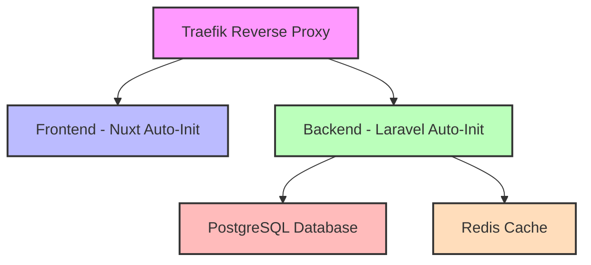

# AGENTS.md
This file provides guidance to Verdent when working with code in this repository.

## Table of Contents
1. Commonly Used Commands
2. High-Level Architecture & Structure
3. Key Rules & Constraints
4. Development Hints

## Commands

### Project Initialization
- `./init.sh` (Linux/Mac) or `init.bat` (Windows) - Initialize entire project
- `cd infra && docker-compose up -d` - Start all services
- `cd infra && docker-compose down` - Stop all services
- `cd infra && docker-compose logs -f [service]` - View logs for specific service

### Backend (Laravel) - After Initialization
- `cd infra && docker-compose exec backend composer install` - Install dependencies
- `cd infra && docker-compose exec backend php artisan migrate` - Run migrations
- `cd infra && docker-compose exec backend ./vendor/bin/pint` - Run code style fixer
- `cd infra && docker-compose exec backend ./vendor/bin/phpstan analyse` - Run static analysis
- `cd infra && docker-compose exec backend php artisan test` - Run tests

### Frontend (Nuxt) - After Initialization
- `cd infra && docker-compose exec frontend npm install` - Install dependencies
- `cd infra && docker-compose exec frontend npm run build` - Build for production
- `cd infra && docker-compose exec frontend npm run dev` - Start dev server (already running)

### Manual Project Creation
**Backend (if you want to recreate Laravel from scratch):**
```bash
cd infra
docker-compose run --rm backend sh -c "composer create-project laravel/laravel . && php artisan key:generate"
```

**Frontend (if you want to recreate Nuxt from scratch):**
```bash
cd infra
docker-compose run --rm frontend sh -c "npx nuxi@latest init . --force && npm install"
```

## Architecture

### Major Subsystems & Responsibilities



- **Traefik**: Reverse proxy and load balancer
  - Routes `localhost` → Frontend (port 3000)
  - Routes `api.localhost` → Backend (port 8000)
  - Dashboard available at `localhost:8080`

- **Backend (Laravel - Auto-initialized)**: PHP framework for API
  - Located in `/backend` (empty initially)
  - Auto-initializes on first `docker-compose up`
  - PHP 8.3 with necessary extensions
  - Automatically installs Pint + PHPStan on init
  - **Important**: Laravel project files are NOT tracked in git by default

- **Frontend (Nuxt - Auto-initialized)**: Vue.js framework
  - Located in `/frontend` (empty initially)
  - Auto-initializes on first `docker-compose up`
  - Node.js 20 Alpine
  - Latest Nuxt version via `npx nuxi`
  - **Important**: Nuxt project files are NOT tracked in git by default

- **Infrastructure**: Docker Compose orchestration
  - Located in `/infra`
  - All services defined in `docker-compose.yml`
  - Environment variables in `.env` (copy from `.env.example`)

### Key Data Flows

1. **Initialization Flow**:
   - User runs `init.sh` or `init.bat`
   - Docker containers build
   - Traefik, DB, Redis start first
   - Backend container runs `docker-entrypoint.sh` → creates Laravel project if missing
   - Frontend container runs `docker-entrypoint.sh` → creates Nuxt project if missing

2. **HTTP Request Flow**:
   - Browser → Traefik → Frontend (for UI) or Backend (for API)
   - Backend → PostgreSQL (for data persistence)
   - Backend → Redis (for caching/sessions)

3. **Development Workflow**:
   - Code changes → Hot reload (both frontend and backend)
   - Changes persist in mounted volumes
   - Dependencies in separate volumes (vendor/, node_modules/)

### External Dependencies

- **Docker & Docker Compose**: Container orchestration
- **Traefik v3.0**: Reverse proxy
- **PostgreSQL 16**: Relational database
- **Redis 7**: In-memory data store
- **PHP 8.3**: Backend runtime
- **Node.js 20**: Frontend runtime

### Development Entry Points

- **Backend**: Auto-generated by Laravel installer on first run
  - Routes: `backend/routes/`
  - Controllers: `backend/app/Http/Controllers/`
  - Models: `backend/app/Models/`

- **Frontend**: Auto-generated by Nuxt CLI on first run
  - Pages: `frontend/pages/`
  - Components: `frontend/components/`
  - Layouts: `frontend/layouts/`

## Key Rules & Constraints

### Project Structure [Critical]
- **Backend and Frontend folders are NOT pre-populated**
- **Projects are created automatically on first Docker container startup**
- **Application code is NOT tracked in git by default** (see .gitignore)
- Only infrastructure files (Dockerfile, entrypoint scripts) are tracked

### Backend (Laravel) [inferred from auto-init]
- PHP version: 8.3
- Latest stable Laravel version via Composer
- Auto-installs: laravel/pint, phpstan/phpstan, nunomaduro/larastan
- Uses PHP built-in server (`php artisan serve`) for development
- Volume for vendor/ directory prevents overwrite

### Frontend (Nuxt) [inferred from auto-init]
- Node version: 20 (Alpine)
- Latest Nuxt version via `npx nuxi@latest init`
- Development server runs with hot-reload
- Volume for node_modules/ prevents overwrite

### Docker & Traefik
- All services in `app-network` bridge network
- Traefik routes based on Host headers
- Persistent volumes for database data, vendor/, and node_modules/
- Auto-restart enabled for all services
- Entrypoint scripts handle initialization

### GitLab CI/CD
- Pipeline expects Laravel project structure in backend/
- Stages: install → lint → analyze → test → build
- Must run after Laravel project initialization
- Paths are relative to backend/ directory

## Development Hints

### First Time Setup

1. **Clone repository**
2. **Run initialization script**:
   - Windows: `init.bat`
   - Linux/Mac: `chmod +x init.sh && ./init.sh`
3. **Wait for auto-initialization** (Laravel + Nuxt projects will be created)
4. **Access applications**:
   - Frontend: http://localhost
   - Backend: http://api.localhost
   - Traefik: http://localhost:8080

### Recreating Projects from Scratch

**Delete existing projects:**
```bash
# Stop containers
cd infra && docker-compose down

# Remove project files (keeps infrastructure)
rm -rf backend/* frontend/*
# Or on Windows: rmdir /s backend frontend (then recreate folders)

# Restart - projects will auto-initialize
docker-compose up -d
```

### Adding Dependencies

**Backend (Laravel):**
```bash
cd infra
docker-compose exec backend composer require vendor/package
docker-compose exec backend composer require --dev vendor/dev-package
```

**Frontend (Nuxt):**
```bash
cd infra
docker-compose exec frontend npm install package-name
docker-compose exec frontend npm install -D dev-package-name
```

### Running Commands

**Backend:**
```bash
cd infra

# Artisan commands
docker-compose exec backend php artisan make:controller ExampleController
docker-compose exec backend php artisan make:model Example -m
docker-compose exec backend php artisan migrate
docker-compose exec backend php artisan db:seed

# Code quality
docker-compose exec backend ./vendor/bin/pint
docker-compose exec backend ./vendor/bin/phpstan analyse

# Tests
docker-compose exec backend php artisan test
```

**Frontend:**
```bash
cd infra

# Nuxt commands (after project init)
docker-compose exec frontend npm run build
docker-compose exec frontend npm run generate

# Add pages/components
docker-compose exec frontend npx nuxi add page about
docker-compose exec frontend npx nuxi add component MyComponent
```

### Troubleshooting

- **"Project not initialized"**: Wait ~15-30 seconds after first `docker-compose up`, check logs: `docker-compose logs backend` or `docker-compose logs frontend`
- **"vendor/autoload.php not found"**: Run `docker-compose restart backend` to trigger entrypoint
- **"node_modules missing"**: Run `docker-compose restart frontend` to trigger entrypoint
- **Port conflicts**: Change ports in `docker-compose.yml` (default: 80, 443, 8080, 5432, 6379)
- **Traefik not routing**: Ensure containers are running: `docker-compose ps`
- **Database connection failed**: Check PostgreSQL is ready: `docker-compose logs db`

### Switching Laravel/Nuxt Versions

**Laravel (backend/docker-entrypoint.sh):**
```bash
# Edit line: composer create-project laravel/laravel . --no-interaction --prefer-dist
# To: composer create-project laravel/laravel:^11.0 . --no-interaction --prefer-dist
```

**Nuxt (frontend/docker-entrypoint.sh):**
```bash
# Edit line: npx nuxi@latest init . --no-install --force
# To: npx nuxi@3.11.0 init . --no-install --force
```

### Committing Code

By default, backend/* and frontend/* are ignored. To track your code:

1. **Edit .gitignore**: Remove the ignore rules for backend/* and frontend/*
2. **Keep infrastructure files**: Ensure Dockerfile and entrypoint scripts remain
3. **Commit application code**:
```bash
git add backend/ frontend/
git commit -m "Add Laravel and Nuxt applications"
```

### Working with GitLab CI

GitLab CI pipeline requires Laravel project structure:

1. **Initialize project first** (via Docker)
2. **Commit Laravel files** to repository
3. **Pipeline will run** on push (install → lint → analyze → test → build)

Alternatively, run CI locally for testing:
```bash
cd backend
composer install
./vendor/bin/pint --test
./vendor/bin/phpstan analyse
php artisan test
```
